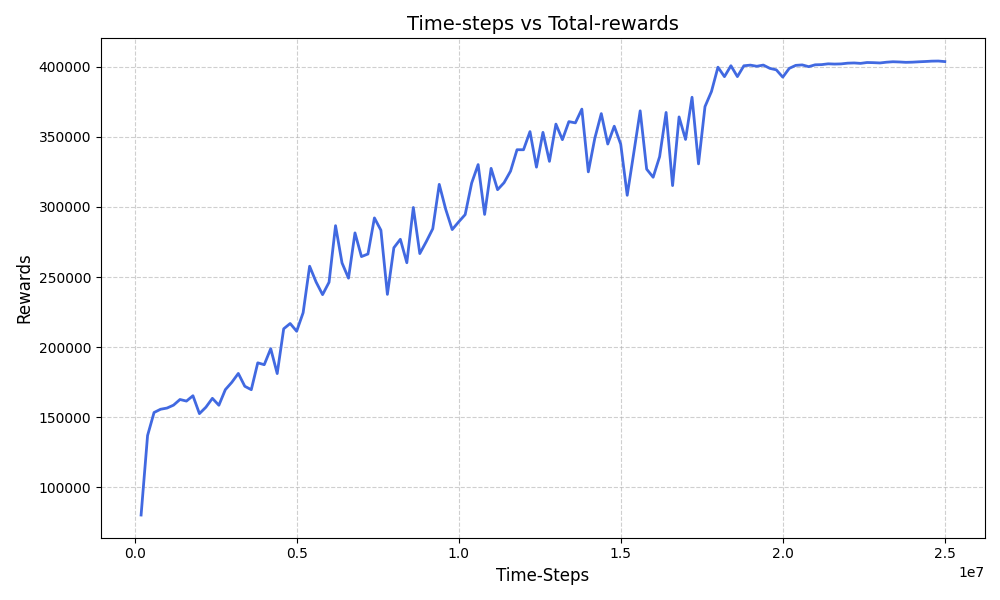

# SAC Mujoco HumanoidStandup-v4


## Overview
This project implements the Soft Actor Critic and Proximal Policy Optimization deep reinforcement learning algorithm  on the `HumanoidStandup-v4` environment from Mujoco via a Gymnasium wrapper. The full details of the environment can be found on the [Gymnasium](https://gymnasium.farama.org/environments/mujoco/humanoid/) website.

## Goals
- Successfully run Soft Actor Critic and Proximal Policy Optimization on the Mujoco environment.
- Train the model on an adequate number of timesteps.
- Tune hyperparameters to optimize rewards during training.
- Properly test the trained model.
- Visualize training progress and results.


## System Requirements

These instructions assume you are using **Ubuntu 24.04.02 LTS**.
- **Python:** 3.12.3
- **Stable-Baselines3:** 2.7.0
- **PyTorch:** 2.8.0
- **Numpy:** 2.2.6
- **Gymnasium:** 1.2.1

## Installation Guide

### 1. Update System Packages
Ensure your system is up to date before installing dependencies:
```bash
sudo apt update && sudo apt upgrade -y
```

### 2. Install Required System Dependencies
Install essential packages:
```bash
sudo apt install -y  git cmake build-essential libopenmpi-dev libomp-dev

### 4. Create and Activate a Virtual Environment
It is recommended to install packages inside a virtual environment:
```bash
python3 -m venv rl_env
source rl_env/bin/activate
```
### 6. Install PyTorch with CUDA Support
Install PyTorch with CUDA 12.4 for GPU acceleration:
```bash
pip install torch torchvision torchaudio --index-url https://download.pytorch.org/whl/cu124
```

### 7. Install Stable-Baselines3
```bash
pip install stable-baselines3==2.7.0
```

### 8. Install Additional Dependencies
```bash
pip install gymnasium==1.2.1 numpy==2.2.6
```

---

## Results

## Results
After training on 25 million timesteps (25,000 episodes), the model was able to successfully stand and remain in a standing position for the remainder of the episode.

<p align="center">
 

</p>

After 20 million time steps model started getting 4 lacs reward points and become stable after standing.
<p align="center">
 

</p>

---
